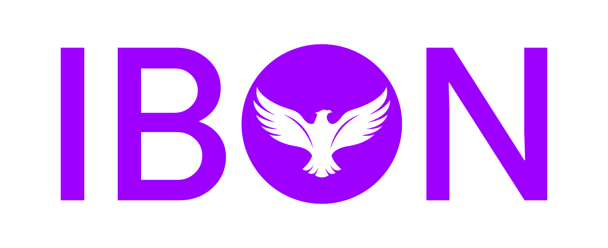
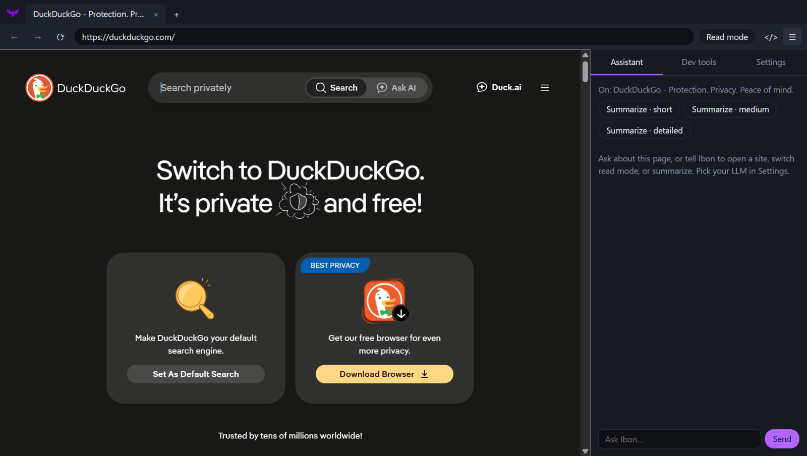
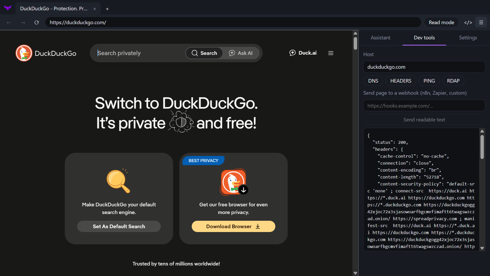
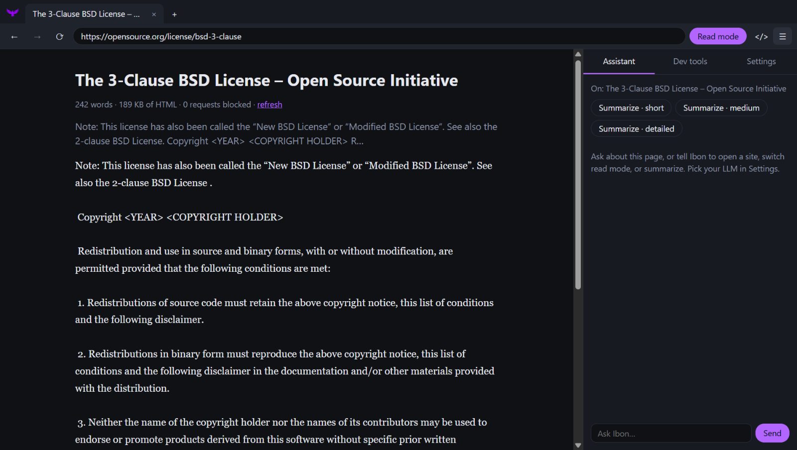

<p align="center">
  
</p>

<p align="center">
  <b>Intelligent Browser Open Network</b><br>
  A light, open-source browser for developers: real Chromium, a small hackable interface,<br>
  and an assistant that works with whichever LLM you choose.
</p>

<p align="center">
  <a href="https://github.com/faseen6351/Ibon/releases"></a>
  <a href="https://github.com/faseen6351/Ibon/actions/workflows/ci.yml"></a>
  <a href="LICENSE"></a>
  
  <a href="CONTRIBUTING.md"></a>
</p>

<p align="center">
  <a href="#download">Download</a> ·
  <a href="#features">Features</a> ·
  <a href="#connect-an-llm-optional">LLM setup</a> ·
  <a href="#build-from-source">Build from source</a> ·
  <a href="tasks.md">Roadmap</a> ·
  <a href="CONTRIBUTING.md">Contribute</a>
</p>

<p align="center">
  
</p>

> **Status: version 0.0.1, a first alpha.** It runs, it is tested on Windows, and it is useful, but it is early. Read
> [Known limitations](#known-limitations) before relying on it. Each crucial update bumps the version.

## Why Ibon

- **Light by design.** No account, no sync service, no bundled extras. The interface is a small React app you can read in an afternoon.
- **Real Chromium.** Pages render in the same engine as Chrome and Edge, through Electron, with the built-in DevTools and PDF viewer.
- **Save data and tokens.** A per-tab **Read mode** blocks images, media and fonts and gives you clean text, which is also the cheapest thing to hand to an LLM.
- **Bring your own LLM, or none.** Everything works without AI. If you want it, connect ChatGPT, Claude, Grok, DeepSeek, Kimi, GLM, a local Ollama model, or any OpenAI-compatible endpoint.
- **Built for developers.** DNS, response-header, ping and whois lookups for the current site, and a one-click webhook for sending a page's text to n8n, Zapier or your own service.
- **Private by default.** Known trackers are blocked, nothing phones home, and crash reports stay on your computer.
- **Open.** BSD-3-Clause. Fork it, change it, ship it.

## Download

Installers are attached to each [release](https://github.com/faseen6351/Ibon/releases).

| OS | Download | Notes |
| --- | --- | --- |
| **Windows** 10 or 11, 64-bit | `Ibon-<version>-win-x64-setup.exe` (installer) or `Ibon-<version>-win-x64.zip` (portable) | Tested. Installs for your user only, no administrator rights needed. |
| **macOS** 13 or later | `Ibon-<version>-mac-arm64.dmg` (Apple silicon) or `Ibon-<version>-mac-x64.dmg` (Intel) | Built and checked by automated tests on every release, not yet tried by hand. |
| **Linux** 64-bit | `Ibon-<version>-linux-x86_64.AppImage` or `Ibon-<version>-linux-amd64.deb` | Built and checked by automated tests on every release, not yet tried by hand. If the AppImage will not start on a distribution that restricts unprivileged user namespaces, use the `.deb`. |

**These builds are not code-signed yet**, so your OS will warn you the first time:

- **Windows:** SmartScreen shows "Windows protected your PC". Choose **More info**, then **Run anyway**.
- **macOS:** Gatekeeper says the app cannot be opened. Right-click Ibon, choose **Open**, then confirm. If macOS says the app is "damaged", run `xattr -cr /Applications/Ibon.app` once.

Signing is on the [roadmap](tasks.md). Until then you can compare the file you downloaded with the one attached to the release, or [build it yourself](#build-from-source).

## Features

| Area | What you get |
| --- | --- |
| **Browsing** | Tabs, back, forward, reload, Chromium DevTools. The address bar knows `localhost:3000`, IP addresses, `[::1]`, `*.local` and `*.test` are dev servers (opened over http), real domains open over https, and anything else (`package.json`, a question) is a search (DuckDuckGo) |
| **Find and shortcuts** | Find in page with match count, a right-click menu (open link in new tab, copy link, search for selection, Inspect), and the usual browser shortcuts, see below |
| **PDFs** | Chromium's built-in PDF viewer (PDFium): thumbnails, zoom, rotate, annotate, download, print |
| **Read mode** | Text-only loading per tab, a clean reader view, word count, page size and blocked-request count |
| **Privacy** | Built-in tracker and ad-network blocking with a per-tab counter; no telemetry |
| **Assistant** | Ask about the current page, summarise it (short, medium or detailed), and let it open URLs, toggle Read mode or copy the page text |
| **Dev tools panel** | DNS, response headers, ping and whois (RDAP) for the current host; send a page's readable text to any webhook |
| **Resilience** | A crashed tab shows a notice with **Reload tab** while your other tabs keep working; crash reports are kept locally ([details](docs/crash-reports.md)) |
| **Security basics** | Sandboxed page views, context isolation, only `http` and `https` navigation, camera, microphone and notifications only after you click Allow (and only for that page), location and clipboard reads always denied, API keys encrypted with your OS keychain |

<table>
  <tr>
    <td width="50%"><br><sub><b>Dev tools panel:</b> response headers, DNS, ping and whois for the current site.</sub></td>
    <td width="50%"><br><sub><b>Read mode:</b> clean text with word count, page size and blocked requests.</sub></td>
  </tr>
</table>

## Keyboard shortcuts

| Action | Windows / Linux | macOS |
| --- | --- | --- |
| New tab, close tab, reopen closed tab | Ctrl+T, Ctrl+W, Ctrl+Shift+T | Cmd+T, Cmd+W, Cmd+Shift+T |
| Next / previous tab | Ctrl+Tab / Ctrl+Shift+Tab | Ctrl+Tab / Ctrl+Shift+Tab |
| Go to tab 1–8, last tab | Ctrl+1–8, Ctrl+9 | Cmd+1–8, Cmd+9 |
| Address bar | Ctrl+L, Alt+D, F6 | Cmd+L |
| Back / forward | Alt+Left / Alt+Right | Cmd+[ / Cmd+] |
| Reload / hard reload | Ctrl+R or F5 / Ctrl+Shift+R | Cmd+R / Cmd+Shift+R |
| Find in page | Ctrl+F | Cmd+F |
| Zoom in / out / reset | Ctrl+= / Ctrl+- / Ctrl+0 | Cmd+= / Cmd+- / Cmd+0 |
| Read mode | Ctrl+Alt+R | Cmd+Alt+R |
| Developer tools | F12 or Ctrl+Shift+I | F12 or Cmd+Alt+I |

## Connect an LLM (optional)

Open the sidebar, choose **Settings**, pick a provider, set the model and paste your API key. For a fully offline
setup, install [Ollama](https://ollama.com), pull a model, and choose **Local / Ollama**; no key is needed.

Presets: Ollama, OpenAI, Anthropic (Claude), xAI (Grok), DeepSeek, Moonshot (Kimi) and Zhipu (GLM). Anything that
speaks the OpenAI chat API, such as OpenRouter, Hugging Face's inference router, LM Studio or vLLM, works through the
**Custom** preset: enter its base URL, a model name and, if it needs one, a key.

Keys stay on your device, encrypted with your OS keychain, and are only sent to the provider you chose. The assistant
can drive the browser when it replies with action tags such as `[action:open_url https://…]`, `[action:read_mode]`,
`[action:summarize medium]` and `[action:copy_content]`.

## Known limitations

Ibon is an early alpha. The things to know before you rely on it:

- **Permission choices are not remembered.** A site that wants your camera, microphone or notifications gets an **Allow / Block** bar; Allow lasts only until that tab loads a new page. That is safe, but you will be asked again next time. Location and clipboard reading are always refused.
- **The assistant acts on its own replies without asking you first.** Treat pages you do not trust accordingly; asking for confirmation is next on the [roadmap](tasks.md).
- **API keys are only encrypted when your operating system provides a keychain.** Without one they are stored with weaker protection.
- **Installers are unsigned**, and only Windows has been tried by hand.
- There are no bookmarks, history, downloads panel, extensions or session restore yet. See the [roadmap](tasks.md).

## How it works

```
┌────────────────────────── Electron main process ─────────────────────────┐
│ tabs (one Chromium view each) · tracker and read-mode request filter     │
│ settings and encrypted keys · LLM calls · DNS, headers, webhook tools    │
│ crash reporter (Crashpad, local only)                                    │
└───────────────▲──────────────────────────────────────────────────────────┘
                │ IPC (validated sender, context isolation, no Node access)
┌───────────────┴───────── React interface (renderer) ─────────────────────┐
│ tab strip · toolbar · reader view · sidebar (assistant, tools, settings) │
└──────────────────────────────────────────────────────────────────────────┘
```

```
electron/   main process: tabs, filtering, IPC, LLM and network tools, crash reports
src/        React interface: App, Reader, Sidebar, typed IPC client
assets/     brand artwork (logo, wordmark)
build/      the app icon used when packaging
scripts/    dev and start launchers, icon builder, end-to-end smoke test
docs/       crash reports, sourcing register, releasing, screenshots
chromium/   a reference slice of upstream Chromium. Never compiled; for studying
            and porting behaviour. See docs/sourcing.md.
```

PDF viewing and crash reporting use the PDFium and Crashpad that ship inside Electron, rather than copies of their
source. [`docs/sourcing.md`](docs/sourcing.md) lists every outside component, its licence, and how it is used.

## Build from source

You need **Node.js 22 or newer**.

```sh
git clone https://github.com/faseen6351/Ibon.git
cd Ibon
npm install
npm start          # build the interface and launch Ibon
```

| Command | What it does |
| --- | --- |
| `npm run dev` | Launch with hot reload |
| `npm run typecheck` | Type-check the interface |
| `npm test` | Run the unit tests |
| `npm run smoke` | Launch the real app and check it end to end (crash recovery, panels, PDF viewer) |
| `npm run pack` | Build an unpacked app into `release/` |
| `npm run dist` | Build installers for your OS into `release/` |

The first run downloads the Electron binary. If you launch Electron by hand from an editor terminal that sets
`ELECTRON_RUN_AS_NODE`, unset it first; the npm scripts already do.

## Roadmap

[`tasks.md`](tasks.md) is the working plan, with priorities and the reasoning behind each decision. Next up:

1. A security baseline: confirmation before the assistant acts, navigation guards, remembered per-site permissions.
2. OpenRouter and Hugging Face presets, and a page **Checkup** that audits performance, accessibility, security and
   SEO locally, then asks your model how to improve it.
3. MCP: Ibon as an MCP server so coding agents can drive and inspect the browser, and as an MCP client for the assistant.
4. Bookmarks, history, downloads and session restore.
5. Signed installers and automatic updates.

## Contributing

Ibon stays small on purpose, so please justify new dependencies and only bring in code whose licence allows commercial
use. [`CONTRIBUTING.md`](CONTRIBUTING.md) has the workflow; [`tasks.md`](tasks.md) marks good first issues. Please
report security problems privately; see [`SECURITY.md`](SECURITY.md).

## Licence and credits

Ibon is released under the [BSD 3-Clause licence](LICENSE): use it, change it and ship it, commercially or not, as
long as you keep the copyright notice. [`docs/licensing.md`](docs/licensing.md) explains the model, including why Ibon
only takes in permissive code and what to do about GPL. Files under `chromium/` keep their original Chromium licence
([`chromium/LICENSE`](chromium/LICENSE)). The notices for everything Ibon is built from are in
[`THIRD_PARTY_NOTICES.md`](THIRD_PARTY_NOTICES.md), and every installer carries a copy.

Ibon stands on the work of the [Electron](https://www.electronjs.org/), [Chromium](https://www.chromium.org/),
[PDFium](https://pdfium.googlesource.com/pdfium/), [Crashpad](https://chromium.googlesource.com/crashpad/crashpad/),
[React](https://react.dev/), [Vite](https://vite.dev/) and [Min](https://github.com/minbrowser/min) projects. Ibon is
not affiliated with or endorsed by Google, the Chromium project, the Electron project or the Min project.
